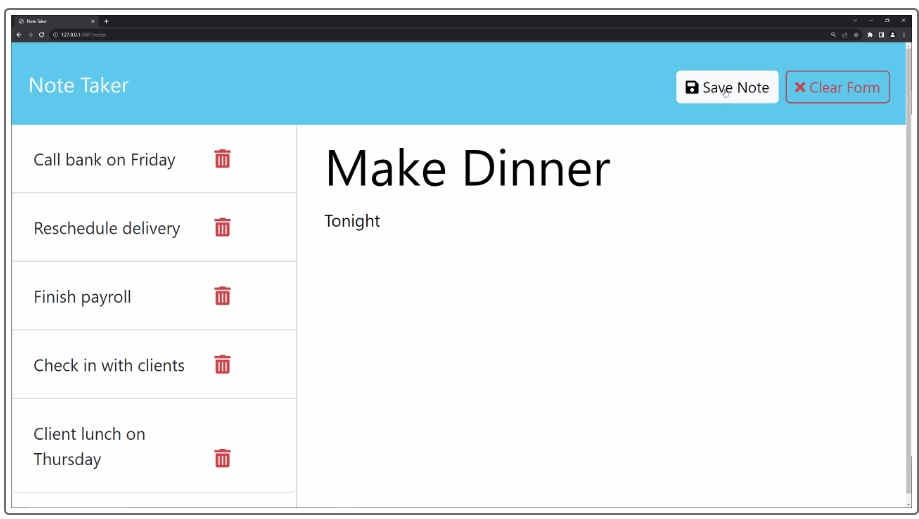

## Project Name
Note Taker

## Description
The Note Taker is a Node.js command-line application that allows users to utilize the Note Taker application and be presented with a landing page with a link to a notes page.  When the user clicks on the link to the notes page, the user is shown a page with existing notes listed in the left-hand column, plus empty fields to enter a new note title and the note’s text in the right-hand column.  When the user enters a new note title and the note’s text, the "Save Note" button and a "Clear Form" button appear in the navigation at the top of the page.  When the user clicks on the Save button, the new note the user has entered is saved and appears in the left-hand column with the other existing notes, and the buttons in the navigation disappear.   When the user clicks on an existing note in the list in the left-hand column
THEN, that note appears in the right-hand column, and a "New Note" button appears in the navigation.  
When the user clicks on the "New Note" button in the navigation at the top of the page, the user is presented with empty fields to enter a new note title and the note’s text in the right-hand column, and the button disappears.

## Technologies
This application uses Node.js for the front end and Express.js for the back end.  

## Installation
To install and run the Note Taker:

1. Clone the repository to your local machine.
2. Install the required dependencies:
   - Run `npm install` to install all dependencies.
   

## Usage
- Run the application using `node server.js.`
- index.html will work on port 3000 as specified by server.js
- Click on Get Started, create a Note Title and the title content.  Hit save, and the note will appear on the left side of the screen.  Delete the note as desired by clicking on the red icon.  

## Testing
- Ensure notes appear saved on the left side of the screen, and notes are deleted when chosen to do so.  

The following image shows the web application's appearance:

## GitHub project URL: https://github.com/maslla100/Note-Taker

## Heroku app URL:  https://note-taker-llamas-bd8d16355482.herokuapp.com/

